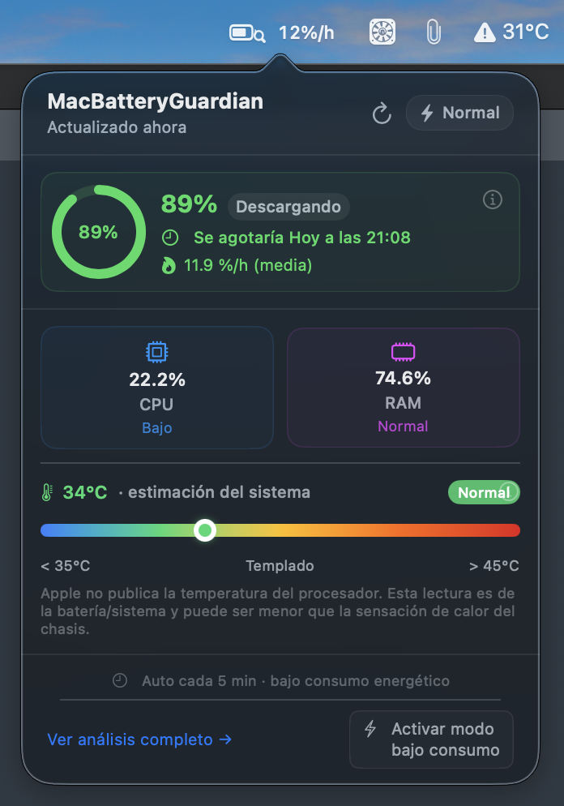
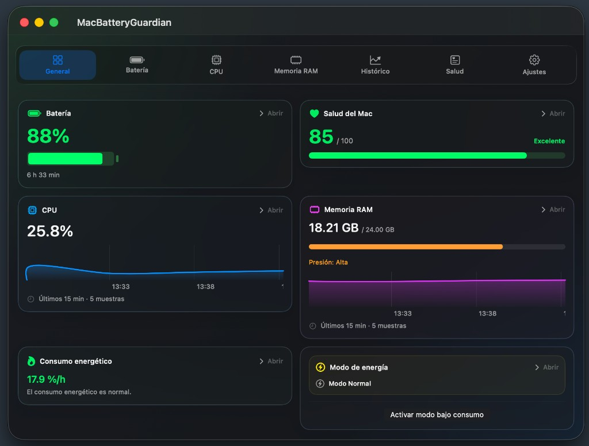
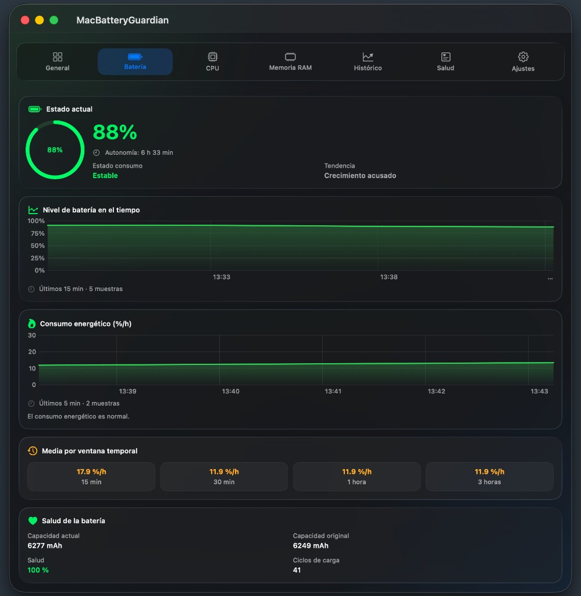
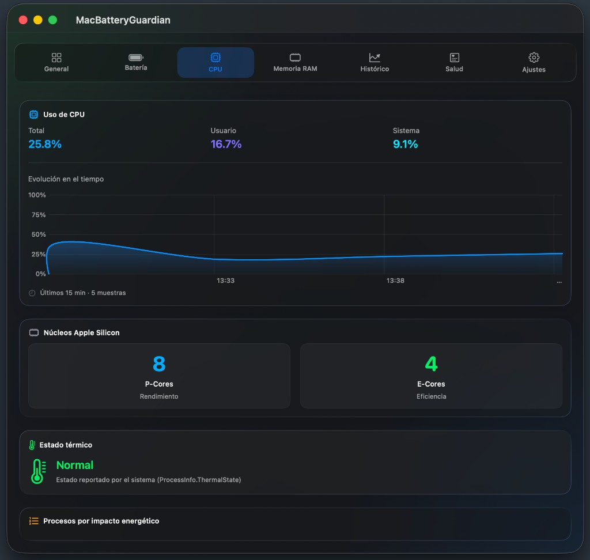
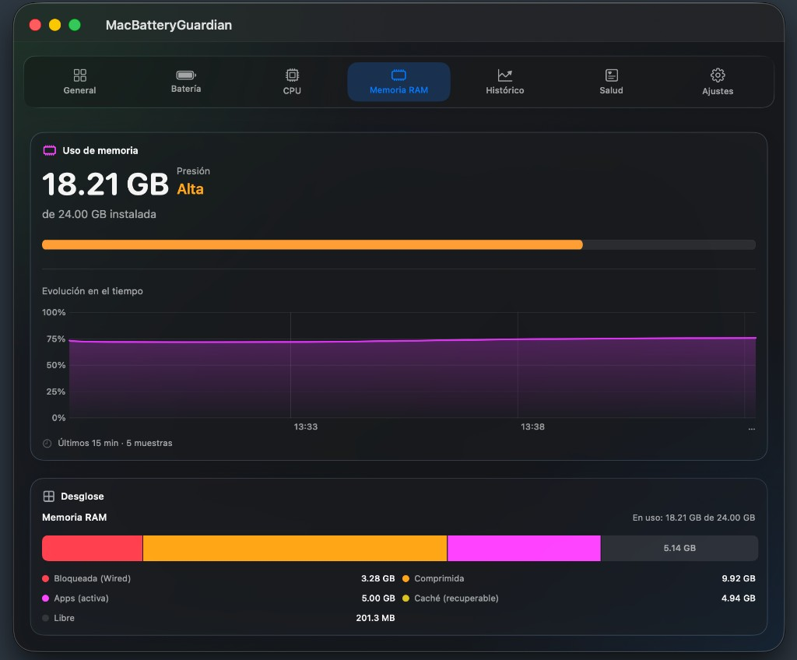
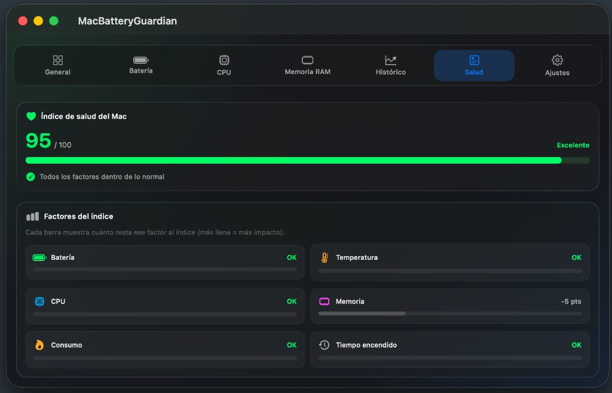
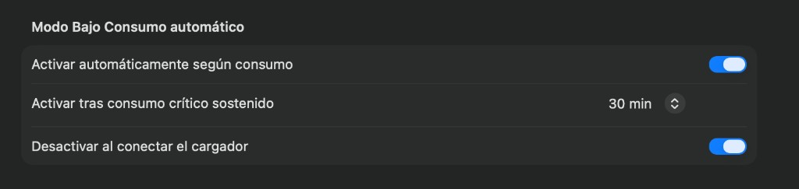
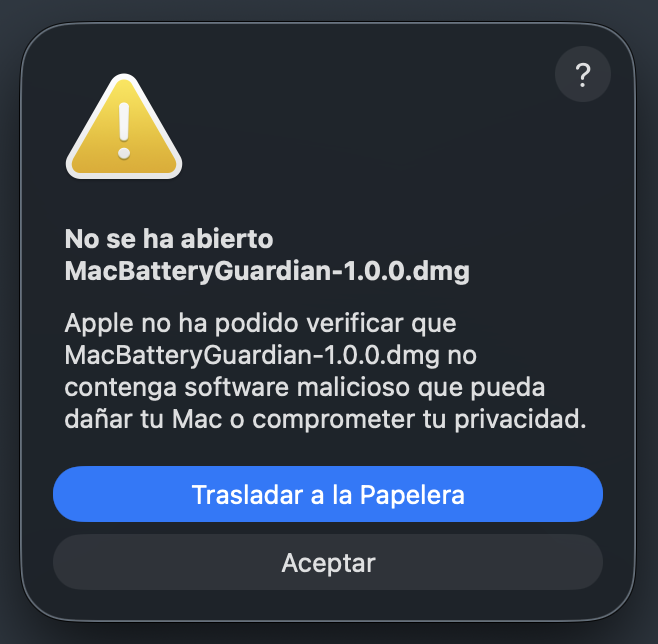
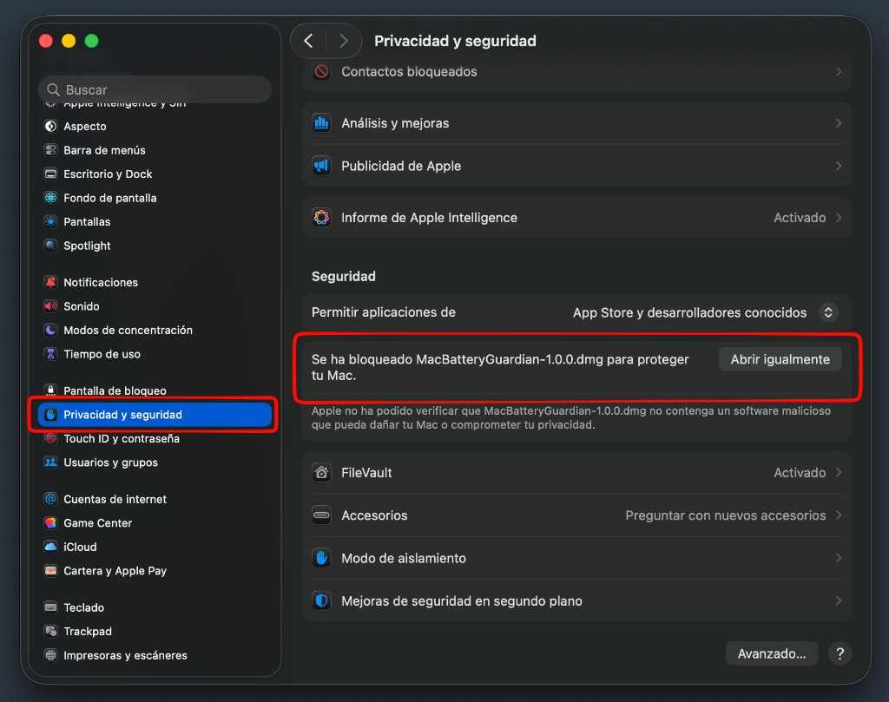

# MacBatteryGuardian

<p align="center">
  <strong>Monitor de batería y sistema para macOS — nativo, ligero y siempre en la barra de menú.</strong><br>
  <sub>Apple Silicon · Swift 6 · SwiftUI · Sin telemetría · 100 % local</sub><br>
  <sub>Desarrollado por <a href="https://github.com/pCresp0">Pablo Crespo Bellido</a></sub>
</p>

<p align="center">
  
  
  
  
  
  <a href="https://github.com/pCresp0/MacBatteryGuardian/releases/latest"></a>
</p>

<p align="center">
  <a href="https://github.com/pCresp0/MacBatteryGuardian/releases/latest"><strong>⬇ Descargar MacBatteryGuardian v1.0.0 (DMG)</strong></a>
</p>

<p align="center">
  
</p>

<p align="center">
  <em>Vista rápida desde la barra de menú: batería, CPU, RAM, temperatura y acceso al análisis completo.</em>
</p>

---

## Índice

- [Qué es](#qué-es)
- [Requisitos del sistema](#requisitos-del-sistema)
- [Descargar e instalar](#descargar-e-instalar)
- [Capturas de pantalla](#capturas-de-pantalla)
- [Cómo usar la app](#cómo-usar-la-app)
- [Compilar desde código fuente](#compilar-desde-código-fuente)
- [Características](#características)
- [Arquitectura](#arquitectura)
- [Privacidad](#privacidad)
- [Limitaciones conocidas](#limitaciones-conocidas)
- [Licencia y autor](#licencia-y-autor)

---

## Qué es

**MacBatteryGuardian** es una utilidad nativa para macOS que se instala en la **barra de menú superior** (junto al icono de Wi‑Fi, batería del sistema, etc.) y monitoriza en segundo plano:

- Nivel y salud de la batería
- Consumo energético estimado (`%/h`)
- Uso de CPU y memoria RAM
- Estado térmico del sistema
- Procesos con mayor impacto energético

No es una app de Dock ni una web embebida: es **100 % nativa**, escrita en **Swift 6 + SwiftUI**, sin cuentas, sin telemetría y sin conexiones de red. Todos los datos se guardan **solo en tu Mac**.

---

## Requisitos del sistema

> **Necesitas macOS 14.0 (Sonoma) o superior** para ejecutar MacBatteryGuardian.

| Requisito | Detalle |
|-----------|---------|
| **macOS** | **14.0 Sonoma** o superior (14.x, 15.x Sequoia, 26.x…) |
| **Procesador** | **Apple Silicon** (M1, M2, M3, M4, M5…) |
| **RAM** | 8 GB mínimo recomendado |
| **Espacio** | ~15 MB para la app + historial local |

> ⚠️ **No compatible con Mac Intel (x86_64)** en esta versión.  
> ⚠️ Para **compilar** desde código fuente necesitas además **Xcode 16+** y **XcodeGen**.

---

## Capturas de pantalla

### Barra de menú — vista rápida (Popover)

Al pulsar el icono en la barra de menú se abre un **panel compacto** con lo esencial:

- Porcentaje de batería y tiempo estimado de agotamiento
- Consumo medio (`%/h`)
- CPU y RAM con indicador de presión
- Temperatura estimada del sistema
- Botón para activar **Modo Bajo Consumo**
- Enlace **"Ver análisis completo →"** que abre la ventana principal

<p align="center">
  
</p>

---

### Ventana principal — pestaña General

Resumen ejecutivo con **tarjetas clicables**. Pulsando en cualquier tarjeta (Batería, CPU, RAM…) saltas directamente a esa pestaña con el detalle completo.

<p align="center">
  
</p>

---

### Pestaña Batería

Estado actual, gráficas de nivel y consumo en el tiempo, medias por ventana temporal (15 min, 30 min, 1 h, 3 h) y datos de salud de la batería (ciclos, capacidad, mAh).

<p align="center">
  
</p>

---

### Pestaña CPU

Uso total, de usuario y del sistema. Gráfica temporal, desglose de núcleos **P-cores / E-cores** en Apple Silicon, estado térmico y procesos ordenados por impacto energético.

<p align="center">
  
</p>

---

### Pestaña Memoria RAM

Uso en GB, presión de memoria, evolución temporal y **desglose segmentado** al estilo Almacenamiento de macOS (wired, comprimida, apps activas, caché recuperable y libre).

<p align="center">
  
</p>

---

### Pestaña Salud

Índice de salud del Mac (0–100) con desglose por factores: batería, temperatura, CPU, memoria, consumo y tiempo encendido. Incluye recomendaciones cuando algún factor impacta la puntuación.

<p align="center">
  
</p>

---

### Pestaña Ajustes

Configuración completa: inicio automático, barra de menú, intervalo de monitorización, notificaciones, **Modo Bajo Consumo automático** (activación por consumo crítico y desactivación al enchufar) y retención del historial.

<p align="center">
  
</p>

> También disponibles: **Histórico** (gráficas de días/semanas) y **Acerca de** (autor, licencia MIT y enlaces al repositorio).

---

## Cómo usar la app

### 1. Localizar el icono

Tras instalar o ejecutar la app, **no aparece en el Dock**. Busca el icono de **MacBatteryGuardian** en la **barra de menú superior** de macOS (parte derecha, junto a los iconos del sistema).

El icono muestra:
- El **nivel de batería** (si lo activas en Ajustes)
- El **consumo estimado** en `%/h` (si lo activas en Ajustes)

### 2. Vista rápida — pulsar el icono

**Clic en el icono** → se abre el **popover** con el resumen instantáneo:

| Elemento | Qué hace |
|----------|----------|
| **Batería (círculo)** | Nivel actual, estado de carga/descarga, hora estimada de agotamiento |
| **CPU / RAM** | Uso actual; **clic** → abre la ventana en esa pestaña |
| **Temperatura** | Estimación basada en estado térmico del sistema |
| **Procesos** | Apps que más consumen en este momento |
| **Activar modo bajo consumo** | Activa el Low Power Mode de macOS |
| **Ver análisis completo →** | Abre la ventana principal |

### 3. Ventana principal — análisis detallado

Desde el popover o directamente, abre la **ventana completa** con 8 pestañas:

| Pestaña | Para qué sirve |
|---------|----------------|
| **General** | Dashboard con tarjetas navegables |
| **Batería** | Detalle de carga, autonomía, tendencias y salud |
| **CPU** | Uso, núcleos Apple Silicon, térmico, procesos |
| **Memoria RAM** | Presión, gráfica temporal y desglose de memoria |
| **Histórico** | Evolución en el tiempo (hoy / 7 días / 30 días) |
| **Salud** | Índice de salud del Mac (0–100) y recomendaciones |
| **Ajustes** | Configuración de la app |
| **Acerca de** | Autor, licencia MIT, GitHub y enlaces |

**Tip:** en la pestaña General, pulsa **"Abrir ›"** o la propia tarjeta para ir al detalle de esa métrica.

### 4. Configurar la app — pestaña Ajustes

En **Ajustes** puedes personalizar:

- **Inicio automático** al arrancar el Mac
- Qué mostrar en la **barra de menú** (% batería, consumo %/h)
- **Intervalo de monitorización** (1–15 min)
- **Notificaciones** de consumo anómalo (con cooldown)
- **Modo Bajo Consumo automático** según consumo crítico
- **Retención del historial** (7–90 días)
- Restablecer configuración por defecto

### 5. Primer uso — permisos

La primera vez que uses ciertas funciones, macOS puede pedirte:

| Permiso | Motivo |
|---------|--------|
| **Notificaciones** | Alertas de consumo elevado |
| **Helper del sistema** | Activar/desactivar Modo Bajo Consumo (`pmset`) |
| **Login Item** | Si activas "Iniciar al arrancar" |

### 6. Cerrar la ventana sin cerrar la app

Al cerrar la ventana principal (✕), la app **sigue en la barra de menú** monitorizando en segundo plano. Para salir del todo, usa **Salir** desde el menú contextual del icono o `⌘Q` con la ventana enfocada.

---

## Descargar e instalar

### Descarga directa (recomendado)

👉 **[Descargar la última versión (DMG)](https://github.com/pCresp0/MacBatteryGuardian/releases/latest)**

Versión actual: **[v1.0.0](https://github.com/pCresp0/MacBatteryGuardian/releases/tag/v1.0.0)** · Archivo: `MacBatteryGuardian-1.0.0.dmg`

**Requisitos:** macOS **14.0 (Sonoma)** o superior · Mac **Apple Silicon** (M1/M2/M3/M4…)

---

### Instalación paso a paso

#### 1. Descarga el DMG

Descarga `MacBatteryGuardian-1.0.0.dmg` desde [Releases](https://github.com/pCresp0/MacBatteryGuardian/releases/latest) (quedará en **Descargas**).

#### 2. Abre el DMG — macOS lo bloqueará la primera vez

Haz **doble clic** en el `.dmg`. Es muy probable que aparezca este aviso:

<p align="center">
  
</p>

> *«No se ha abierto MacBatteryGuardian-1.0.0.dmg»*  
> *Apple no ha podido verificar que no contenga software malicioso…*

**Pulsa «Aceptar»** (no «Trasladar a la Papelera»). El DMG no se ha abierto todavía; es normal.

#### 3. Ve a Privacidad y seguridad → «Abrir igualmente»

1. Abre **Ajustes del sistema** (icono ⚙️).
2. Entra en **Privacidad y seguridad**.
3. Baja hasta la sección **Seguridad**.
4. Verás: *«Se ha bloqueado MacBatteryGuardian-1.0.0.dmg para proteger tu Mac»*.
5. Pulsa **Abrir igualmente**.

<p align="center">
  
</p>

6. Confirma con contraseña o Touch ID si macOS te lo pide.
7. Vuelve a **Descargas** y haz **doble clic** otra vez en el `.dmg` — ahora sí se abrirá.

#### 4. Instala la app

1. Se abrirá una ventana con **MacBatteryGuardian** y un enlace a **Aplicaciones**.
2. **Arrastra** la app a **Aplicaciones**.
3. Expulsa el DMG (clic derecho → Expulsar).

#### 5. Abre la app (puede volver a avisar una vez)

Abre **MacBatteryGuardian** desde Aplicaciones. macOS **puede** mostrar el mismo tipo de aviso, pero ahora con el nombre de la **app** (no del DMG).

- **Clic derecho** sobre la app → **Abrir** → **Abrir**, **o**
- Otra vez **Ajustes → Privacidad y seguridad → Abrir igualmente**.

Solo hace falta **una vez por archivo** (DMG y app). Después abre con doble clic normal.

#### 6. Busca el icono en la barra de menú

La app **no aparece en el Dock**. Mira arriba a la **derecha** en la barra de menú.

---

### ¿Por qué sale ese aviso?

macOS incluye **Gatekeeper**, un sistema de seguridad que comprueba que el software provenga de un **desarrollador verificado por Apple**.

| Qué pasa | Por qué |
|----------|---------|
| Bloquea el DMG o la app | MacBatteryGuardian **no está notarizada** con cuenta **Apple Developer de pago** (99 €/año) |
| Dice «no se puede verificar el desarrollador» | La app está firmada para desarrollo / distribución interna, no con **Developer ID** |
| Pide ir a Privacidad y seguridad | Es la forma estándar de macOS de decir: *«¿confías tú en este archivo descargado de internet?»* |

**No significa que la app tenga malware.** El código es **open source** en este mismo repositorio; puedes revisarlo. Apple simplemente no puede «avalizarla» sin el proceso de pago.

Para evitar estos pasos haría falta pagar Apple Developer y **notarizar** el DMG. Para un equipo o uso personal, **Abrir igualmente** es suficiente y seguro si confías en el proyecto.

---

### Atajos si prefieres no usar Ajustes

**Terminal** (quita la cuarentena de internet del DMG y de la app):

```bash
xattr -cr ~/Downloads/MacBatteryGuardian-1.0.0.dmg
open ~/Downloads/MacBatteryGuardian-1.0.0.dmg
# Tras instalar en Aplicaciones:
xattr -cr /Applications/MacBatteryGuardian.app
open /Applications/MacBatteryGuardian.app
```

**Clic derecho → Abrir** en la app (desde Aplicaciones), tras haber abierto el DMG.

---

### Otras formas de obtenerla

#### Compilar tú mismo (gratis, sin pagar Apple Developer)

Con **Xcode** (App Store) y tu **Apple ID personal** (iCloud):

```bash
git clone https://github.com/pCresp0/MacBatteryGuardian.git
cd MacBatteryGuardian
brew install xcodegen
xcodegen generate
open MacBatteryGuardian.xcodeproj
```

En Xcode → **Signing & Capabilities** → elige tu **Personal Team** en ambos targets → **`⌘R`**.

#### Generar el DMG (para quien mantiene el proyecto)

```bash
./scripts/build-dmg.sh
# → dist/MacBatteryGuardian-1.0.0.dmg
```

---

### ¿Hace falta pagar Apple Developer (99 €)?

**No**, para ti, compañeros o uso interno. El aviso de seguridad de macOS es solo la **primera vez**.

Solo necesitas la cuenta de pago si quieres que **cualquier desconocido** instale sin ese paso (notarización).

<details>
<summary>Distribución pública sin avisos (opcional, requiere Apple Developer)</summary>

```bash
SIGN_IDENTITY="Developer ID Application: Tu Nombre (TEAMID)" \
NOTARIZE=1 \
APPLE_ID=tu@email.com \
APP_PASSWORD=xxxx-xxxx-xxxx-xxxx \
TEAM_ID=TU_TEAM_ID \
./scripts/build-dmg.sh
```

</details>

---

## Compilar desde código fuente (desarrollo)

### Requisitos de desarrollo

- macOS **14.0+**
- **Xcode 16** o superior ([App Store](https://apps.apple.com/app/xcode/id497799835))
- **XcodeGen**: `brew install xcodegen`
- Cuenta de desarrollador Apple (gratuita vale para uso personal)

### Pasos

```bash
# 1. Clonar
git clone https://github.com/pCresp0/MacBatteryGuardian.git
cd MacBatteryGuardian

# 2. Generar proyecto Xcode
xcodegen generate

# 3. Abrir en Xcode
open MacBatteryGuardian.xcodeproj
```

En Xcode → **Signing & Capabilities** de ambos targets (`MacBatteryGuardian` y `MacBatteryGuardianHelper`):

1. Selecciona tu **Team**.
2. Activa **Automatically manage signing**.

Compilar y ejecutar: **`⌘R`**

O desde terminal:

```bash
xcodebuild -scheme MacBatteryGuardian -configuration Debug build
open ~/Library/Developer/Xcode/DerivedData/MacBatteryGuardian-*/Build/Products/Debug/MacBatteryGuardian.app
```

---

## Características

### Barra de menú
- Icono dinámico con batería y/o consumo `%/h`
- Popover interactivo con acceso a cada métrica
- Activación de Modo Bajo Consumo en un clic

### Monitorización inteligente
- Ciclo periódico configurable (por defecto cada 5 min)
- Consumo `%/h` con suavizado al arrancar (evita lecturas falsas)
- Índice de salud 0–100 con recomendaciones accionables
- Historial local persistido en disco
- Notificaciones nativas con cooldown
- Pausa automática cuando el Mac entra en reposo

### Interfaz
- Diseño **Liquid Glass** en macOS 26+ con fallback en macOS 14+
- Ventana con altura adaptativa por pestaña
- Gráficas temporales con **Swift Charts**
- Desglose de RAM estilo Almacenamiento de macOS

---

## Stack tecnológico

| Capa | Tecnología |
|------|------------|
| Lenguaje | **Swift 6** (strict concurrency) |
| UI | **SwiftUI** + **Swift Charts** |
| Patrón | **MVVM** + servicios `actor` |
| APIs del sistema | **IOKit**, **sysctl**, **proc_info**, **ProcessInfo** |
| Energía / batería | **IOPS**, **IORegistry** |
| Privilegios | **SMJobBless** + helper XPC |
| Proyecto | **XcodeGen** |

---

## Arquitectura

```
Barra de menú (PopoverView)
        │
        ▼
Ventana principal (8 pestañas SwiftUI)
        │
        ▼
ViewModels (@MainActor)
        │
        ▼
MonitoringManager ──► Services (IOKit, sysctl, proc_info…)
        │                    │
        │                    └── MacBatteryGuardianHelper (pmset)
        ▼
Persistencia local (JSON en Application Support)
```

---

## Privacidad

| | |
|---|---|
| Telemetría | ❌ Ninguna |
| Red | ❌ Sin conexiones |
| Cuentas | ❌ No requeridas |
| Datos | ✅ Solo en `~/Library/Application Support/MacBatteryGuardian/` |

---

## Limitaciones conocidas

| Funcionalidad | Estado |
|---------------|--------|
| Temperatura CPU (°C exactos) | ⚠️ Apple no la expone en Apple Silicon; se estima vía `thermalState` |
| Ventiladores (RPM) | ❌ No disponible vía APIs públicas |
| Impacto por proceso | ⚠️ Estimado (CPU + memoria + threads) |
| Low Power Mode | ⚠️ Requiere helper firmado + autorización del usuario |

---

## Roadmap

- [x] Capturas de pantalla en el README
- [x] Script de empaquetado DMG (`scripts/build-dmg.sh`)
- [ ] ~~Primer release en GitHub con DMG notarizado~~ → [v1.0.0 publicado](https://github.com/pCresp0/MacBatteryGuardian/releases/tag/v1.0.0)
- [ ] Tests unitarios
- [ ] Localización EN
- [ ] Soporte Intel si hay demanda

---

## Licencia y autor

**MIT License** — ver [LICENSE](LICENSE).

**Pablo Crespo Bellido**

<p align="center">
  <a href="https://github.com/pCresp0">GitHub — más proyectos</a>
  &nbsp;·&nbsp;
  <a href="https://www.linkedin.com/in/pablocrespobellido">LinkedIn</a>
</p>

<p align="center">
  <sub>Si te resulta útil, considera darle una ⭐ al repositorio.</sub>
</p>
